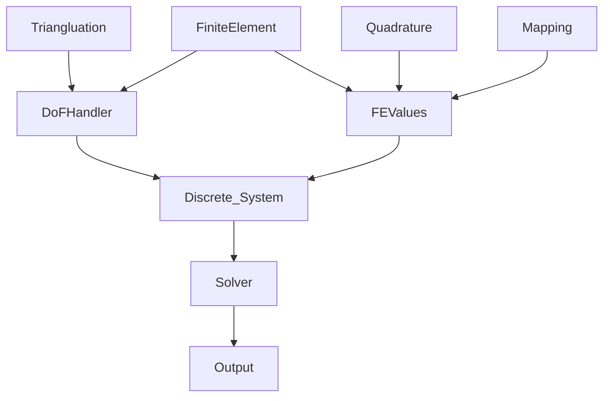

#  Finite element method

## 4.1 Math foundation

 Why using weak formulation? 

Laplace equation strong form: 

$\Delta u = f  \; in \; \Omega$    
$u =0 \; on \; \partial\Omega$

- 1910s, Laplace equation doesn't necessarily have a solution
  
Laplace equation the weak formulation

$(\underline{\nabla}\phi,\underline{\nabla} u)=(\phi,f) \; \forall \;test \; function \; \phi$

- always have a function
- multiply from the left, a trick for implementation
- if basis functions are linearly independent, then you get N equations for N coefficients. (the Galerkin-Petrov method)
 
$u_h = \sum_{j=1}^N U_j\phi_j(x)$

$(\underline{\nabla}\phi_i,\underline{\nabla} u_h)=(\phi_i,f) \; i=1:N$

## 4.2 Discrete system
Question 1 :How to define the basis functions?
- **Mesh** of geometry
- Each mesh mapped to the reference cell (mapping)
- **Basis function** defined on the reference cell
- Each shape function corresponds to a **DOF** on the global mesh

The bilinear form

$\sum_{j=1}^N (\underline{\nabla}\phi_i,\underline{\nabla}\phi_j) U_j = (\phi_i,f)$

$\underline{\underline{K}} \cdot \underline{U} = \underline{F}, K_{ij}= (\underline{\nabla}\phi_i,\underline{\nabla}\phi_j), F_i=(\phi_i,f)$

Question 2: how to compute $K_{ij}$,$F_i$?

- First, from the mapping, we have:
  
$d\phi = \underline{\nabla_x} \phi d\underline{x} = \underline{\nabla_a} \phi d\underline{a}$; 
$d\underline{x} = \underline{\underline{J}} \cdot d\underline{a}$

which lead to:

$\underline{\nabla}_x\phi = \underline{\underline{J}}^{-T} \underline{\nabla}_a\phi$

With the precedent relation, we could calculate $K_{ij}$ and $F_i$ on the reference cell:

$K_{ij} = (\underline{\nabla}\phi_i,\underline{\nabla}\phi_j) 
= \sum_{e=1}^E\int_{\Omega_e}\underline{\nabla}_x\phi_i \cdot \underline{\nabla}_x\phi_j$

$= \sum_{e=1}^E\int_{\Omega_a} \underline{\underline{J}}^{-T}(\underline{a}) \underline{\nabla}_a \phi_i(\underline{a}) \cdot \underline{\underline{J}}^{-T}(\underline{a}) \underline{\nabla}_a \phi_j(\underline{a}) |det(\underline{\underline{J}})|$

The quadrature rule:

$K_{ij} = \sum_{e=1}^E\sum_{g=1}^G \underline{\underline{J}}^{-T}(\underline{a_g}) \underline{\nabla}_a \phi_i(\underline{a_g}) \cdot \underline{\underline{J}}^{-T}(\underline{a_g}) \underline{\nabla}_a \phi_j(\underline{a_g}) \cdot |det(\underline{\underline{J}}(\underline{a_g}))| \omega_g
$

Question 3: how to store $K,U,F$?

- sparse $K$, stored in compressed row format
- $U,F$, stored as arrays
- Effecient algorithms:
  - matrix vector products, preconditionners
- Large scale computations, data structure and algorithms must be parallel

Question 4: how to solve?

- directo solver
- iterative solver
- parallel solver

Question 5: what to do with the solution,

- Visualization
- evaluate for quantities of interest
- estimate error

## 4.3. Concepts and components for FEM
Flow chart of FEM:

Implementation of concepts and components:
- each component is a collection of classes and functions

Summary:

Concept and component:
- concepts are abstract things
- component are software implementation of the concepts
- concepts comes from:
  - abstraction of mathematical elements 
  - what you need in the postprocessing

Exemple of Deal.II

- step 1: Triangulation
- step 2: DoFhandler
- step 3: linear system

